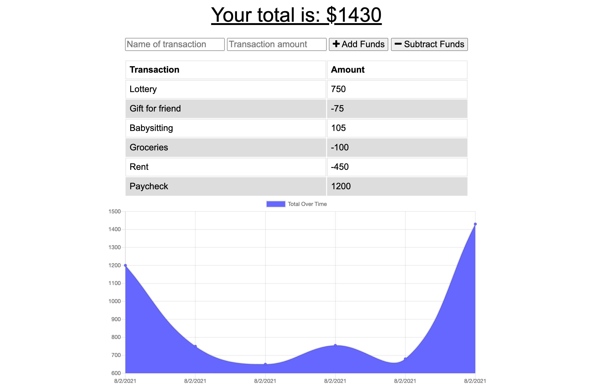
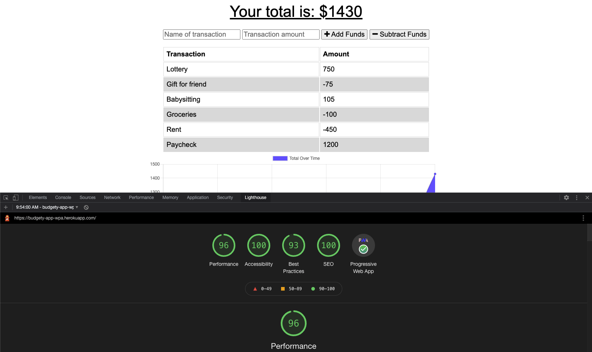

# Budget Tracker (Progressive Web Application)

## Description
I was assigned to add offline functionality to a Budget Tracker application. It was a pretty painless ordeal using service worker and webmanifest, and that honestly suprised me. I dont know how feasible it will be but I will attempt to make future applications progressive web apps. Especially since it doesnt seem to be too much extra work when you have mobile first approach.

## Table of Contents
- [Installation](#installation)
- [Usage](#usage)
- [Notes](#notes)
- [Credits](#credits)
- [License](#license)

## Installation
Locally: After forking the repo, do an npm install of the node modules and start the server. For best results, clear the browser's memory cache on localhost:3000

## Usage
Click <a href="https://budgety-app-wpa.herokuapp.com/" target="_blank">here</a> to see the deployed site. 
 

## Notes
Im really happy with this assignments final result. As a bonus I ran the app through lighthouse and added the requirements to the html file (like an apple touch icon and description) to see what it's score is and improve it. After the edits, I got some really cool scores. 
 

## Credits
Thanks to Leif for helping me with the deployment on Heroku.

## License
Copyright 2021, Keith Watford

Permission is hereby granted, free of charge, to any person obtaining a copy of this software and associated documentation files (the "Software"), to deal in the Software without restriction, including without limitation the rights to use, copy, modify, merge, publish, distribute, sublicense, and/or sell copies of the Software, and to permit persons to whom the Software is furnished to do so, subject to the following conditions:

The above copyright notice and this permission notice shall be included in all copies or substantial portions of the Software.

THE SOFTWARE IS PROVIDED "AS IS", WITHOUT WARRANTY OF ANY KIND, EXPRESS OR IMPLIED, INCLUDING BUT NOT LIMITED TO THE WARRANTIES OF MERCHANTABILITY, FITNESS FOR A PARTICULAR PURPOSE AND NONINFRINGEMENT. IN NO EVENT SHALL THE AUTHORS OR COPYRIGHT HOLDERS BE LIABLE FOR ANY CLAIM, DAMAGES OR OTHER LIABILITY, WHETHER IN AN ACTION OF CONTRACT, TORT OR OTHERWISE, ARISING FROM, OUT OF OR IN CONNECTION WITH THE SOFTWARE OR THE USE OR OTHER DEALINGS IN THE SOFTWARE." 